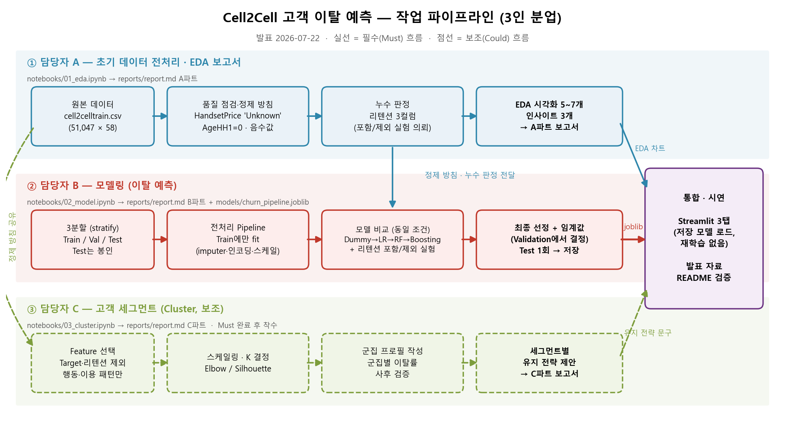
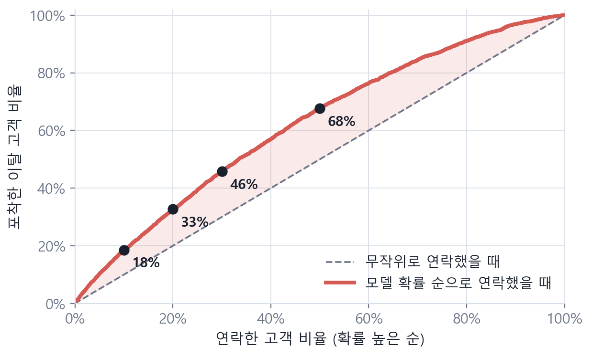
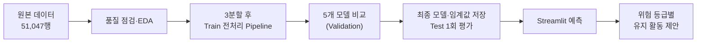
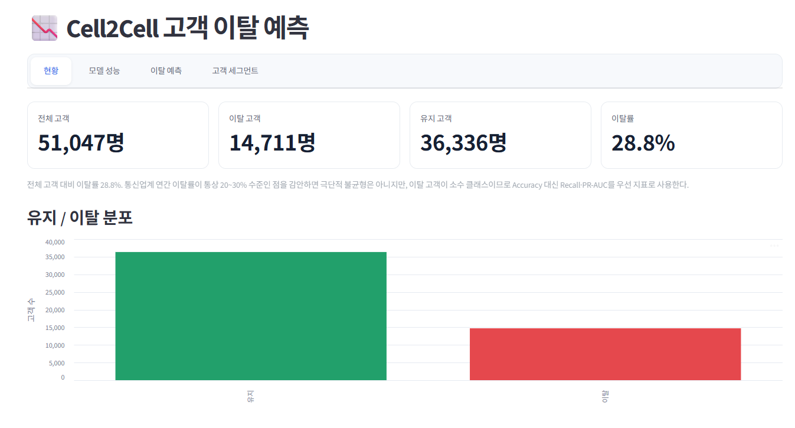

# Cell2Cell 통신사 고객 이탈 예측

> 통신사 고객의 요금·통화·단말 데이터로 이탈 가능성이 높은 고객을 미리 찾아내고, 위험 등급별 유지 활동을 제안하는 서비스



## 목차

1. [팀 소개](#1-팀-소개)
2. [프로젝트 개요](#2-프로젝트-개요)
3. [요구사항](#3-요구사항)
4. [데이터](#4-데이터)
5. [데이터 분석 및 전처리](#5-데이터-분석-및-전처리)
6. [모델링](#6-모델링)
7. [주요 기능](#7-주요-기능)
8. [프로젝트 구조](#8-프로젝트-구조)
9. [기술 스택](#9-기술-스택)
10. [설치 및 실행](#10-설치-및-실행)
11. [수행 화면](#11-수행-화면)
12. [한계 및 개선 방향](#12-한계-및-개선-방향)
13. [회고](#13-회고)

---

## 1. 팀 소개

### 팀명

**SKN 2nd Project — Churn Prediction Team**

### 팀원 및 역할

| 이름 | GitHub | 담당 역할 | 주요 작업 |
| --- | --- | --- | --- |
| 안정민 | [@AhnJung-min](https://github.com/AhnJung-min) | PM · 서비스 통합 | 프로젝트 구조 설계, 전처리 스크립트(`src/data.py`), Streamlit 4탭, Test 평가, README·발표자료 |
| 이양원 | [@t91004](https://github.com/t91004) | 데이터 전처리 · EDA | 노트북 00·01, 데이터 품질 점검, EDA 7종, 전처리 결과서 작성 |
| 김유진 | [@ujinkim2001](https://github.com/ujinkim2001) | 모델링 · 평가 | 노트북 02, 모델 비교 실험, Dummy 기준선·PR-AUC 도입, 학습 결과서 |
| 김성훈 | [@tjdgns8343](https://github.com/tjdgns8343) | 군집분석 | 노트북 03, K-Means 세그먼트 분석, 군집 결과서 |

> 역할을 완전히 분리하지 않고, 각 작업에 담당자 1명과 검토자 1명을 지정했습니다. 상세 분업과 검토 짝은 [`docs/team_plan.md`](docs/team_plan.md)에 있습니다.

### 프로젝트 일정

| 단계 | 기간 | 주요 작업 | 산출물 |
| --- | --- | --- | --- |
| 기획 | 07.14 ~ 07.15 | 주제·사용자·Target 정의, 분업 계획 | [`docs/project_plan.md`](docs/project_plan.md), [`docs/team_plan.md`](docs/team_plan.md) |
| 데이터·EDA | 07.15 ~ 07.18 | 품질 점검, EDA 7종, 전처리 Pipeline | [`reports/preprocessing_report.md`](reports/preprocessing_report.md) |
| 모델링 | 07.18 ~ 07.20 | 5개 모델 비교, 최종 모델·임계값 선정 | [`reports/modeling_report.md`](reports/modeling_report.md) |
| 군집분석 | 07.20 | K-Means 고객 세그먼트 (보조 분석) | [`reports/clustering_report.md`](reports/clustering_report.md) |
| 서비스·통합 | 07.20 ~ 07.21 | Streamlit 연결, 최종 Test 평가, 발표 준비 | [`streamlit_app/app.py`](streamlit_app/app.py), [`reports/test_report.md`](reports/test_report.md) |

---

## 2. 프로젝트 개요

### 프로젝트명

**Cell2Cell 통신사 고객 이탈 예측 및 유지 전략 제안**

### 프로젝트 기간

- 2026.07.14 ~ 2026.07.22 (발표)

### 프로젝트 배경 및 필요성

통신 시장은 신규 가입자 확보 여지가 줄어든 포화 시장이라, 기존 고객을 지키는 일이 곧 매출 방어입니다. 그런데 이탈은 **해지 시점에야 결과로 확인**되기 때문에, 그때는 이미 되돌릴 방법이 없습니다. 고객 1명이 이탈하면 해당 매출이 사라지는 동시에 그 자리를 메우기 위한 신규 획득 비용이 다시 발생합니다.

이 데이터의 이탈률은 **28.8%** 로, 고객 100명 중 29명이 떠나는 상황입니다. 고객유지팀이 한정된 캠페인 예산으로 방어 활동을 하려면 "누구에게 먼저 연락할 것인가"를 정해야 하는데, 지금은 그 우선순위를 정할 근거가 없습니다.

### 프로젝트 목표

1. **데이터 관점** — 51,047명의 실제 통신사 고객 데이터를 정제하고, 이탈과 관련된 신호와 누수 위험 변수를 근거와 함께 판별한다.
2. **모델 관점** — 불균형 데이터에서 Accuracy가 아닌 **PR-AUC를 주 지표**로 삼아 여러 모델을 동일 조건에서 비교하고, 선정 근거를 남긴다.
3. **서비스 관점** — 저장된 모델을 다시 학습하지 않고 불러와, 고객 한 명의 이탈 확률·위험 등급·유지 활동을 화면에서 제안한다.

### 문제 정의

> **통신사 고객유지팀 담당자**가 **이탈 방어 캠페인 대상자 선정**을 할 수 있도록 **고객 요금·통화·단말 데이터**를 이용해 **이탈 여부(Churn)** 를 예측하고 **위험 등급별 유지 활동**을 제안합니다.

| 항목 | 정의 |
| --- | --- |
| 사용자 | 통신사 고객유지팀 담당자 |
| 예측 대상 | 현재 가입 중인 고객 (1명 = 1행, 스냅샷) |
| Target | `Churn` — 0 = 유지 / 1 = 이탈 |
| 예측 시점 | 고객의 요금·통화·단말·계약 정보가 확보된 시점. 해지 사유·해지일 등 이탈 이후 정보는 사용하지 않음 |
| 주요 평가지표 | **PR-AUC** (주 지표) · Recall · F1 (ROC-AUC는 보조) |
| 중요 오류 | **FN** — 이탈할 고객을 놓치면 방어 기회 자체가 사라져 고객을 잃지만, FP는 캠페인 비용 낭비에 그치고 예산 범위에서 통제 가능 |
| 활용 방법 | 이탈 확률 순으로 정렬해 고위험 고객부터 유지 캠페인 대상자로 선정 |

---

## 3. 요구사항

### 필수 기능

| ID | 기능 | 설명 | 완료 여부 |
| --- | --- | --- | --- |
| FR-01 | 고객 현황 | 전체 고객의 유지/이탈 분포와 특성 구간별 이탈률을 시각화합니다. | [x] |
| FR-02 | 고객 조회 | 예시 고객(고위험·중위험·저위험)을 불러와 입력값으로 사용합니다. | [x] |
| FR-03 | 개별 이탈 예측 | 고객 정보를 입력해 이탈 확률과 판정 결과를 출력합니다. | [x] |
| FR-04 | 위험 등급 | 예측 확률에 따라 저위험·중위험·고위험 3단계로 표시합니다. | [x] |
| FR-05 | 모델 성능 | 5개 모델의 동일 조건 비교와 최종 선정 근거, 혼동행렬을 보여줍니다. | [x] |

### 선택 기능

| ID | 기능 | 설명 | 완료 여부 |
| --- | --- | --- | --- |
| FR-06 | 일괄 예측 | CSV를 업로드해 여러 고객을 한 번에 예측합니다. | [ ] 미구현 |
| FR-07 | 유지 활동 제안 | 위험 등급에 맞는 유지 활동을 함께 제안합니다. | [x] |
| FR-08 | 고객 세그먼트 | 신규 고객의 이용 지표로 5개 고객군 중 하나를 배정하고 전략을 제안합니다. | [x] |

> FR-06은 `data/raw/cell2cellholdout.csv`(라벨 없음)를 활용할 계획이었으나 이번 범위에서는 구현하지 않았습니다. FR-08은 계획에 없던 군집분석을 보조 분석으로 추가하면서 생긴 기능입니다.

---

## 4. 데이터

### 데이터 출처

| 항목 | 내용 |
| --- | --- |
| 데이터셋명 | Cell2Cell Telecom Churn Dataset |
| 제공 기관·작성자 | Duke University Fuqua School of Business, Teradata Center for CRM (Kaggle 업로더 `jpacse`) |
| 출처 URL | https://www.kaggle.com/datasets/jpacse/datasets-for-churn-telecom |
| 라이선스 | *Kaggle 데이터셋 페이지의 라이선스 표기 확인 필요* |
| 수집 방법 | Kaggle 다운로드 |
| 수집·다운로드 일자 | 2026.07.14 |
| 데이터 규모 | 51,047행 × 58열 (학습용) / 20,000행 (holdout, Target 전부 결측) |

> 원본 CSV는 저장소에 포함하지 않습니다. 아래 [설치 및 실행](#10-설치-및-실행)의 안내대로 직접 내려받아 `data/raw/`에 배치해 주세요.

### Target 분포

| Target | 의미 | 건수 | 비율 |
| --- | --- | --- | --- |
| 0 | 유지 | 36,336 | 71.18% |
| 1 | 이탈 | 14,711 | 28.82% |

### 주요 컬럼

| 컬럼명 | 자료형 | 설명 | 학습 사용 여부 |
| --- | --- | --- | --- |
| `Churn` | object → int | 이탈 여부 (Yes/No → 1/0) | **Target** |
| `CurrentEquipmentDays` | int | 현재 단말기 사용 일수 | O — 중요도 1위 |
| `MonthsInService` | int | 서비스 이용 개월 수 | O — 중요도 2위 |
| `MonthlyMinutes` | float | 월 통화 시간 | O |
| `PercChangeMinutes` | float | 통화 시간 변화율 | O |
| `TotalRecurringCharge` | float | 월 정기 요금 | O |
| `CreditRating` | object | 신용등급 (1-Highest ~ 7-Lowest) | O (One-Hot) |
| `ServiceArea` | object | 서비스 지역 (고유값 747개) | O (3자리 축약 후 One-Hot) |
| `HandsetPrice` | object | 단말기 가격 (숫자 + `'Unknown'` 혼재) | O (숫자 변환 + 플래그) |
| `RetentionCalls` 외 2개 | int | 리텐션팀 접촉 이력 | **X — 누수 의심으로 제외** |
| `CustomerID` | int | 고객 식별자 | X |

- 전체 Feature 목록·의미: [`artifacts/feature_schema.json`](artifacts/feature_schema.json), [`artifacts/model_metadata.json`](artifacts/model_metadata.json)
- 데이터 상세 점검 결과: [`reports/preprocessing_report.md`](reports/preprocessing_report.md)

---

## 5. 데이터 분석 및 전처리

### 데이터 품질 점검

| 점검 항목 | 확인 결과 | 처리 방법과 근거 |
| --- | --- | --- |
| 결측값 | 14개 컬럼, 최대 1.78%(`AgeHH1/2` 각 909건) | 비율이 낮고 고르게 분산 → 대부분 Train 중앙값 대체. `AgeHH1/2`만 0으로 대체 (아래 참고) |
| 중복값 | `CustomerID` 중복 0건, 전체 행 중복 미발견 | 처리 불필요 |
| 이상값 | `MonthlyRevenue`(3건)·`TotalRecurringCharge`(8건)·`CurrentEquipmentDays`(76건)에 음수 | 전체 대비 최대 0.15%로 미미해 1차 전처리에서는 미조정. 고도화 시 clip 검토 |
| 자료형 | `HandsetPrice`에 숫자 문자열과 `'Unknown'` 혼재 | 숫자 변환 + `HandsetPrice_Unknown` 플래그 컬럼 신설 |
| 클래스 불균형 | 이탈 28.82% (중간 정도 불균형) | SMOTE 미적용, 모델링에서 `class_weight='balanced'` 우선 적용 |
| 데이터 누수 | 해지 사유·해지일 등 사후 컬럼은 없음. 단 리텐션 3개 컬럼이 역인과 의심 | 포함/제외 두 버전을 만들어 모델링에서 비교 후 **제외 채택** |

### 핵심 EDA

#### 1. Target 분포


**알 수 있는 점:** 이탈 28.8% / 유지 71.2%로 중간 정도의 불균형입니다. Accuracy만으로 평가하면 "전부 유지"라고만 찍어도 71%가 나오므로, **Recall·F1·PR-AUC를 함께 봐야 합니다.** 극단적 불균형은 아니라서 SMOTE보다 `class_weight='balanced'`를 우선 시도하기로 했습니다.

#### 2. 단말기 노후도와 이탈의 관계


**알 수 있는 점:** 이탈 고객이 현재 단말기를 더 오래 써온 쪽에 치우쳐 있고(Target과 상관계수 최고, r=0.10), 웹을 지원하지 않는 구형 단말 고객의 이탈률(37.4%)이 웹 지원 단말 고객(27.9%)보다 뚜렷이 높습니다. **"단말기 노후도"라는 관점으로 묶으면 업그레이드 프로모션이라는 구체적 유지 전략의 근거가 됩니다.** 실제로 모델의 피처 중요도 1위도 `CurrentEquipmentDays`였습니다.

#### 3. 리텐션팀 접촉 이력 — 누수 의심


**알 수 있는 점:** 리텐션팀이 연락한 고객의 이탈률(45.0%)이 연락 없는 고객(28.2%)보다 훨씬 높습니다. 언뜻 "유지팀이 연락하면 오히려 이탈이 는다"로 읽히지만, 실제로는 **이탈 위험 신호가 이미 보인 고객을 리텐션팀이 먼저 골라 연락한 역인과관계**일 가능성이 높습니다. 접촉 시점 컬럼이 없어 확인할 방법이 없었기 때문에, 전처리에서 임의로 결정하지 않고 **포함/제외 두 벌의 데이터셋을 모두 만들어 모델링 단계에서 판정**하기로 했습니다.

> 이 밖에 신용등급별 이탈률(비직관적 패턴), 지역별 편차, 수치형 상관계수 히트맵 등 총 7종의 EDA를 수행했습니다. 전체 시각화와 해석은 [`notebooks/01_eda.ipynb`](notebooks/01_eda.ipynb)와 [`reports/preprocessing_report.md`](reports/preprocessing_report.md)에 있습니다.

### 데이터 분할

| 데이터 | 건수 | 비율 | 이탈률 | 사용 목적 |
| --- | --- | --- | --- | --- |
| Train | 30,627 | 60% | 28.82% | 전처리 학습과 모델 학습 |
| Validation | 10,210 | 20% | 28.81% | 모델·임계값 선택 |
| Test | 10,210 | 20% | 28.81% | 최종 성능 확인 1회 |

- 분할 방법: Stratified random split (`stratify=Churn`)
- Random State: `42`
- 선택 이유: 고객 1명 = 1행의 스냅샷 데이터라 시간 순서나 그룹 분할이 필요 없고, 클래스 비율을 세 세트에 동일하게 유지하기 위해 층화 추출을 사용했습니다.

> 결측치 대표값, One-Hot 인코딩 범주, StandardScaler 기준, ServiceArea 희소 지역 목록은 **모두 분할 이후 Train에서만 계산**하고 Validation·Test에는 transform만 적용했습니다.
> `cell2cellholdout.csv`는 라벨이 전부 결측이라 이 분할에 전혀 관여하지 않습니다.

### 전처리 및 Feature 선택

| 구분 | 적용 방법 | 선택 이유 |
| --- | --- | --- |
| 수치형 결측치 | Train 중앙값 대체 | 결측 비율이 낮고(0.3~0.7%) 무작위로 흩어져 있어 행 삭제보다 정보 손실이 적음 |
| `AgeHH1`/`AgeHH2` 결측 | **0으로 대체** (중앙값 아님) | 이 데이터가 이미 0을 "세대원 없음" 센티널로 광범위하게 사용 중(각 1.4만·2.6만 건). 평균 나이를 채우기보다 기존 0-인코딩 관례와 일관성을 유지 |
| 범주형 인코딩 | `OneHotEncoder(handle_unknown="ignore")` | 카테고리 간 크기·순서 관계가 없어 순서형 숫자 대신 원-핫 사용. 신규 데이터의 미지 값에도 에러 없이 대응 |
| 수치형 스케일링 | `StandardScaler` | 스케일에 민감한 모델(Logistic Regression)과 트리 계열을 같은 조건에서 공정 비교하기 위함 |
| 고차원 범주 축소 | `ServiceArea` 747개 → 앞 3자리 대도시권 코드 57개 → Train 기준 50건 미만 18개 지역은 `Other` | 원-핫 시 차원 폭발 방지 + 표본이 적은 지역의 통계적 불안정성 제거 |
| 클래스 불균형 | SMOTE 미적용, `class_weight='balanced'` | 극단적 불균형이 아니고, 합성 샘플 생성보다 가중치 조정이 단순하고 해석이 쉬움 |
| Feature 선택 | 도메인 기준 제외만 수행 (자동 선택 미적용) | 최종 126개 Feature (수치형 33 + 범주형 93) |

**제외한 주요 Feature**

| Feature | 제외 이유 |
| --- | --- |
| `CustomerID` | 단순 식별자 — 예측 정보가 없고, 남기면 우연한 패턴을 학습할 위험 |
| `RetentionCalls`<br>`RetentionOffersAccepted`<br>`MadeCallToRetentionTeam` | **누수 의심** — 접촉 시점 컬럼이 없어 예측 시점에 확보 가능한 정보인지 검증 불가 (아래 E02 참고) |

---

## 6. 모델링

### 실험 환경

모든 모델은 **동일한 데이터 분할(random_state=42), 동일한 전처리 Pipeline, 동일한 평가지표**로 비교했습니다. 전처리기는 Train에만 fit했고, 모델·임계값 선택은 Validation에서만 수행했으며 Test는 최종 1회만 사용했습니다.

### 모델 선정 이유

| 모델 | 선정 이유 |
| --- | --- |
| DummyClassifier (Most Frequent) | 학습 모델이 넘어야 할 기준 성능 확인. **Accuracy의 함정**을 드러내는 역할 |
| Logistic Regression | 이탈 확률과 Feature 영향 방향을 설명하기 쉬운 선형 기준선 |
| Decision Tree | 이탈 판단 규칙을 직관적으로 확인 가능 |
| Random Forest | 비선형 관계와 Feature 상호작용을 안정적으로 학습 |
| HistGradientBoosting | EDA에서 "단일 변수로는 설명되지 않고 조합이 중요"하다는 관찰이 나와, 부스팅 계열을 추가 |

### 모델 성능 비교

Retention 제외(최종 채택) 데이터 기준, 임계값 0.5:

| 모델 | 데이터 | Accuracy | Precision | Recall | F1 | PR-AUC | ROC-AUC | 비고 |
| --- | --- | --- | --- | --- | --- | --- | --- | --- |
| DummyClassifier | Validation | 0.7119 | 0.0000 | 0.0000 | 0.0000 | 0.2881 | 0.5000 | 기준 모델 |
| Logistic Regression | Validation | 0.5872 | 0.3650 | 0.5850 | 0.4495 | 0.3764 | 0.6228 |  |
| Decision Tree | Validation | 0.5603 | 0.3588 | 0.6683 | 0.4669 | 0.3885 | 0.6257 |  |
| Random Forest | Validation | 0.6916 | 0.4550 | 0.3555 | 0.3992 | 0.4280 | 0.6665 | Accuracy 최고, Recall 최저 |
| **HistGradientBoosting** | Validation | 0.6193 | 0.3996 | 0.6390 | 0.4917 | **0.4453** | **0.6738** | **채택** |
| **최종 모델** | **Test** | **0.6188** | **0.3997** | **0.6438** | **0.4932** | **0.4432** | **0.6709** | **최종 1회 평가** |

> **Dummy가 알려주는 것:** 모든 고객을 "유지"로만 찍어도 Accuracy는 0.7119가 나오지만 Recall과 F1은 0.0000입니다. 이탈 고객을 한 명도 찾지 못한다는 뜻이며, 이것이 Accuracy 대신 PR-AUC를 주 지표로 삼은 이유입니다.

Retention 포함 버전을 포함한 전체 비교표는 [`artifacts/modeling/model_metrics_long.csv`](artifacts/modeling/model_metrics_long.csv)에 있습니다.

### 성능 개선 실험

| 실험 ID | 변경 내용 | 비교 기준 | Validation 결과 | 판단 |
| --- | --- | --- | --- | --- |
| E01 | 기본 Feature + 학습 모델 | Dummy (PR-AUC 0.2881) | 모든 학습 모델이 Dummy 초과 (0.3764~0.4453) | 성공 |
| E02 | 리텐션 3개 컬럼 **포함** | 제외 버전 대비 | PR-AUC 0.4494 vs 0.4453 (**+0.0041**), ROC-AUC 0.6787 vs 0.6738 (+0.0049) | **성능은 우위지만 미채택** |
| E03 | 알고리즘 비교 (5종) | Logistic Regression 대비 | PR-AUC 0.3764 → 0.4453 (HistGradientBoosting) | 성공 |
| E04 | `class_weight='balanced'` 적용 | — | Recall 확보 목적으로 적용 | 적용 (미적용 대비 수치 비교 **미기록**) |
| E05 | 분류 임계값 조정 (0.3~0.7) | 기본 0.5 | 0.3: Recall 0.9402 / 접촉 8,668명<br>0.5: Recall 0.6390 / 접촉 4,705명<br>0.7: Recall 0.0812 / 접촉 400명 | **0.5 유지** |

**E02가 성능이 더 좋은데도 제외한 이유:**
차이가 PR-AUC 기준 0.0041에 불과했습니다. 리텐션팀 접촉 정보가 예측 시점에 이미 확보되는 정보인지 확인할 방법이 없는데(접촉 시점 컬럼 부재), 이 정도 이득을 위해 검증 불가능한 누수 위험을 안고 가는 것은 사전 이탈 예방이라는 운영 목적에 맞지 않는다고 판단했습니다.

**E05에서 0.5를 유지한 이유:**
임계값은 성능이 아니라 **예산의 문제**입니다. 낮추면 더 많이 잡지만 접촉 비용이 늘고, 높이면 비용은 줄지만 놓치는 고객이 늘어납니다. 캠페인 단가와 이탈 손실이 정해지지 않은 상태에서는 균형점인 0.5를 기본값으로 두고, 운영 단계에서 조정할 수 있도록 `config.yaml` 한 곳에서 관리하도록 했습니다.

**하이퍼파라미터 탐색(GridSearch 등)은 이번 범위에서 수행하지 않았습니다.** 데이터 버전 결정과 알고리즘 비교를 우선했고, 남은 개선 여지로 [12번](#12-한계-및-개선-방향)에 기록했습니다.

### 최종 모델

| 항목 | 내용 |
| --- | --- |
| 최종 모델 | HistGradientBoostingClassifier (Retention 제외) |
| 선정 데이터 | Validation |
| 선정 기준 | PR-AUC 우선, Recall·F1 함께 검토 |
| 분류 임계값 | 0.5 (Validation에서 확정, Test에 고정 적용) |
| 저장 파일 | `models/histgradientboosting_without_retention_final.joblib` |
| 입력 Feature 수 | 126개 |
| 메타데이터 | [`artifacts/model_metadata.json`](artifacts/model_metadata.json) |

**선정 이유:**
Retention 제외 버전에서 PR-AUC 0.4453, ROC-AUC 0.6738, Recall 0.6390으로 세 지표 모두 1위였습니다. Random Forest는 Accuracy가 0.6916으로 더 높지만 Recall이 0.3555에 그쳐 실제 이탈 고객을 절반 이상 놓칩니다. 이 프로젝트의 목적은 "놓치지 않는 것"이므로 Accuracy를 일부 포기하더라도 Recall이 높은 쪽을 선택했습니다. EDA에서 개별 변수의 상관이 약하고(최대 0.10) 변수 조합이 중요할 것으로 예상했는데, 실제로 부스팅 계열이 가장 앞선 것도 이 선택을 뒷받침합니다.

**Confusion Matrix 해석 (Test, 임계값 0.5):**

| 실제 \ 예측 | 유지(0) | 이탈(1) |
| --- | ---: | ---: |
| 유지(0) | 4,424 (TN) | **2,844 (FP)** |
| 이탈(1) | **1,048 (FN)** | 1,894 (TP) |

실제 이탈 고객 2,942명 중 **1,894명(64.4%)을 탐지**했고 1,048명을 놓쳤습니다. 놓친 1,048명은 방어 기회 자체가 사라진 고객이라 이 프로젝트에서 가장 비싼 오류입니다. 반대로 유지 고객 2,844명에게 불필요한 캠페인이 나가는데, 이는 예산 범위에서 통제 가능한 비용이며 임계값으로 조절할 수 있습니다.

**모델의 실질적 효용 — 확률 순 정렬:**

정답을 맞히는 것보다 **"누구부터 연락할지" 순서를 정해주는 것**이 이 모델의 실제 쓸모입니다. Test 데이터에서 예측 확률 순으로 정렬했을 때:

| 연락한 고객 비율 | 포착한 이탈 고객 | 무작위 대비 |
| --- | --- | --- |
| 상위 10% | 18.5% | 1.85배 |
| 상위 20% | 32.7% | 1.63배 |
| 상위 30% | 45.8% | 1.53배 |
| 상위 50% | 67.6% | 1.35배 |



재현: `python src/make_deck_charts.py` → [`artifacts/deck_chart_metrics.json`](artifacts/deck_chart_metrics.json)

### 보조 분석 — 고객 세그먼트 (K-Means)

이탈 예측과 **독립된 비지도학습 분석**입니다. `Churn`을 사용하지 않고 이용 패턴 8개 지표만으로 고객을 나눈 뒤, 사후적으로 군집별 이탈률을 확인했습니다.

| Cluster | 세그먼트 | 고객 수 | 비중 | 사후 이탈률 | 추천 전략 |
| ---: | --- | ---: | ---: | ---: | --- |
| 0 | Loyal Long-term (장기 안정) | 10,861 | 21.3% | 33.2% | 장기 감사 보상, 단말 교체 할인 |
| 1 | Premium Heavy (프리미엄 헤비) | 3,421 | 6.7% | 30.8% | VIP 요금제, 초과 사용 패키지 |
| 2 | Multi-line (다회선) | 10,840 | 21.2% | 29.4% | 가족 결합 할인, 추가 회선 혜택 |
| 3 | Regular (일반) | 20,262 | 39.7% | 27.2% | 개인화 요금제 추천, 업셀링 |
| 4 | High-Maintenance (고관여) | 5,663 | 11.1% | 24.1% | 품질 우선 점검, 전담 응대 |

K=5는 Silhouette 최대값(K=2, 0.3970)이 아니라 Elbow 추이·군집 균형·해석 가능성·마케팅 활용성을 함께 고려해 선택했습니다. 상세 근거는 [`reports/clustering_report.md`](reports/clustering_report.md)에 있습니다.

### 딥러닝 비교

이번 범위에서는 수행하지 않았습니다. 51,047행 × 126 Feature의 정형 표 데이터이고 개별 변수의 신호가 약한 문제라, 부스팅 계열 대비 기본 MLP의 이점을 기대하기 어렵다고 판단해 우선순위에서 제외했습니다.

---

## 7. 주요 기능

Streamlit 단일 파일 4탭으로 구성했습니다.

### 1. 현황

- 전체 고객의 유지/이탈 분포와 규모
- 특성 구간별(5분위) 이탈률 비교 — Feature 선택 가능
- 위험도 구간별 고객 수 집계 (Validation 기준)
- EDA 핵심 인사이트와 해석 캡션

### 2. 모델 성능

- 5개 모델의 Validation 지표 비교표 (정렬 기준 선택 가능)
- 최종 모델의 혼동행렬과 해석
- 주요 Feature(순열 중요도)와 해석

### 3. 이탈 예측

- 고객 정보 입력 폼 — **원본 CSV에서 자동 생성**해 학습·화면 Feature 일치를 보장
- 예시 고객(고위험·중위험·저위험) 불러오기
- **이탈 확률 · 이탈 판정 · 위험 등급** 출력
- 위험 등급별 추천 유지 활동 제안

| 위험 등급 | 확률 구간 | 추천 활동 |
| --- | --- | --- |
| 🔴 고위험 | 0.7 이상 | 즉시 전담 상담 · 할인/요금제 재설계 · 이탈 방어 쿠폰 |
| 🟡 중위험 | 0.4 ~ 0.7 | 맞춤 혜택 안내 · 요금제 재안내 · 만족도 설문 |
| 🟢 저위험 | 0.4 미만 | 정기 모니터링 · 업셀링 |

### 4. 고객 세그먼트

- 5개 고객군의 프로파일과 추천 전략 카드
- 신규 고객의 8개 이용 지표 입력 → 세그먼트 배정
- 배정 결과에 맞는 마케팅 액션 표시

> Streamlit에서는 모델을 다시 학습하지 않고, 미리 저장한 전처리 Pipeline과 모델을 `joblib`으로 불러와 예측합니다.

---

## 8. 프로젝트 구조

```
skn-2nd-project-churnpred/
├── README.md
├── requirements.txt
├── config.yaml                  # 경로·Target·최종 모델·임계값 (단일 출처)
├── presentation.pptx            # 발표자료
├── assets/images/               # docs · eda · modeling · deck 시각화
├── data/
│   ├── raw/                     # 원본 (Git 제외, 직접 다운로드)
│   ├── interim/                 # 리텐션 포함/제외 실험용
│   └── processed/               # 최종 학습 데이터 (train/val/test)
├── notebooks/
│   ├── 00_data_check.ipynb      # 1차 데이터 점검
│   ├── 01_eda.ipynb             # EDA 7종 + 인사이트
│   ├── 02_model.ipynb           # 분리→비교→선정→Test→저장
│   └── 03_cluster.ipynb         # K-Means 세그먼트 (보조)
├── src/
│   ├── clean.py                 # 공통 정제 규칙 (노트북 02·03이 import)
│   ├── data.py                  # 로드·검증·3분할·전처리 Pipeline
│   ├── predict.py               # 설정 로드 + 추론 (앱·노트북·테스트 공유)
│   ├── evaluate_test.py         # 최종 Test 평가 (1회만 실행)
│   ├── save_metadata.py         # 모델 메타데이터 생성
│   └── make_deck_charts.py      # 발표자료용 차트 생성
├── models/
│   ├── histgradientboosting_without_retention_final.joblib
│   └── kmeans_pipeline.joblib
├── artifacts/                   # 전처리기·Feature 스키마·지표
├── reports/
│   ├── preprocessing_report.md  # 데이터 전처리 결과서
│   ├── modeling_report.md       # 모델 학습 결과서
│   ├── clustering_report.md     # 군집분석 결과서
│   └── test_report.md           # 최종 Test 평가
├── streamlit_app/app.py         # 4탭 시연 앱
├── tests/test_inference.py      # 모델 로드·신규 고객 예측 검증
└── docs/                        # project_plan · team_plan
```

### 시스템 흐름



### 가이드 표준 구조와의 차이

프로젝트 가이드의 권장 구조를 기준으로, 이 프로젝트에서 다르게 둔 부분과 이유입니다.

| 가이드 | 이 프로젝트 | 이유 |
| --- | --- | --- |
| `docs/requirements.md`<br>`data_dictionary.md`<br>`validation_plan.md` | `docs/project_plan.md`<br>`reports/preprocessing_report.md` | 요구사항·Data Card·검증 계획을 두 문서에 통합. 파일을 쪼개면 같은 내용을 이중 관리하게 되어 합쳤습니다. |
| `src/features.py`<br>`src/train_ml.py` | `src/data.py`<br>`notebooks/02_model.ipynb` | Feature 생성이 전처리와 분리되지 않아 `data.py`에 통합. 모델 학습은 비교·선정 과정을 보여줘야 해서 노트북에서 수행합니다. |
| `src/evaluate.py` | `src/evaluate_test.py` | 이름을 좁혀 **Test 1회 평가 전용**임을 드러냈습니다. 임계값 탐색 코드를 의도적으로 넣지 않아 구조적으로 Test 오염을 막습니다. |
| `streamlit_app/pages/` 3개 | `app.py` 단일 파일 4탭 | 탭이 같은 모델·데이터를 공유해 한 파일이 더 단순합니다. 군집 세그먼트 탭이 추가되어 4탭입니다. |
| `reports/training_report.md` | `modeling_report.md`<br>`clustering_report.md`<br>`test_report.md` | 담당자별로 파일을 나눠 동시 편집 시 머지 충돌을 막았습니다. |
| 노트북 `01`~`03` | `00`~`03` (4개) | 데이터 점검과 EDA를 분리했고, 군집분석 노트북이 추가됐습니다. |

---

## 9. 기술 스택

| 구분 | 기술 | 사용 목적 |
| --- | --- | --- |
| Language | Python 3.12 | 데이터 분석과 서비스 구현 |
| Data | pandas, NumPy | 데이터 로드·전처리 |
| Visualization | Matplotlib, Seaborn, Altair | EDA와 결과 시각화 |
| Machine Learning | scikit-learn (HistGradientBoosting, K-Means, Pipeline) | 모델 학습·평가 |
| Model I/O | joblib | 전처리 Pipeline + 모델 저장·로드 |
| Config | PyYAML | `config.yaml` 단일 출처 관리 |
| Service | Streamlit | 예측 서비스 화면 |
| Test | pytest | 모델 로드·추론 검증 |
| Collaboration | GitHub (PR 기반), Jupyter | 형상 관리와 협업 |

학습 시점의 정확한 버전은 [`artifacts/model_metadata.json`](artifacts/model_metadata.json)의 `versions`에 기록되어 있습니다.

---

## 10. 설치 및 실행

### 실행 환경

- Python: `3.12`
- OS: Windows / macOS / Linux

### 설치

```bash
git clone https://github.com/skn-2nd-churn-pred/skn-2nd-project-churnpred.git
cd skn-2nd-project-churnpred
python -m venv .venv
source .venv/bin/activate        # Windows: .venv\Scripts\activate
python -m pip install -r requirements.txt
```

### 데이터 준비

[Kaggle 데이터셋 페이지](https://www.kaggle.com/datasets/jpacse/datasets-for-churn-telecom)에서 내려받아 아래 경로에 배치합니다. (원본은 저장소에 포함되지 않습니다.)

```
data/raw/cell2celltrain.csv     # 학습용 (Target 포함, 51,047행)
data/raw/cell2cellholdout.csv   # ⚠️ 라벨 없음 — Test 사용 금지, 시연용
```

### 전처리 데이터 생성

```bash
python src/data.py               # data/processed/{train,val,test}.csv 생성
```

### Streamlit 실행

```bash
streamlit run streamlit_app/app.py
```

### 검증 및 산출물 재생성

```bash
python tests/test_inference.py    # 모델 로드·신규 고객 예측 검증 (pytest 없이도 실행)
python src/save_metadata.py       # artifacts/model_metadata.json 갱신
python src/evaluate_test.py       # 최종 Test 평가 — 한 번만 실행
python src/make_deck_charts.py    # 발표자료용 차트 생성
```

> **발표 전 체크:** README·발표자료의 성능 수치가 [`reports/test_report.md`](reports/test_report.md)·[`artifacts/model_metadata.json`](artifacts/model_metadata.json)의 실제 수치와 일치하는지 확인합니다.

---

## 11. 수행 화면

> ⚠️ **작성 필요** — `streamlit run streamlit_app/app.py`로 실행한 뒤 아래 4개 화면을 캡처해
> `assets/images/screenshots/`에 저장하고, 각 항목의 주석(`<!-- -->`)을 해제하세요.

### 현황

`assets/images/screenshots/tab1_overview.png`

<!--  -->

### 모델 성능

`assets/images/screenshots/tab2_performance.png`

<!--  -->

### 개별 고객 이탈 예측

`assets/images/screenshots/tab3_predict.png`

<!--  -->

### 고객 세그먼트

`assets/images/screenshots/tab4_segment.png`

<!--  -->

> 발표자료(`presentation.pptx`)의 시연 슬라이드에도 같은 화면이 들어가므로, 캡처를 한 번에 준비하면 양쪽에 함께 쓸 수 있습니다.

---

## 12. 한계 및 개선 방향

| 현재 한계 | 결과에 미치는 영향 | 향후 개선 방법 |
| --- | --- | --- |
| **개별 변수의 신호가 약함** — Target과의 상관계수가 최대 0.10 | PR-AUC 0.44, Recall 0.64 수준으로 성능 상한이 존재. 통신 이탈 예측이 학계에서도 어려운 문제로 알려진 것과 일치 | 월별 이용 이력을 확보해 "변화의 추세"를 Feature로 생성 |
| **리텐션 컬럼 누수 여부 미확정** | 성능이 더 좋은 데이터 버전을 근거 부족으로 포기 | 접촉 시점(timestamp) 컬럼 확보 후 재검증 |
| **스냅샷 데이터, 수집 시점 불명** | 현재 통신 시장(5G 전환 등)과의 차이를 알 수 없음 | 최신 데이터 확보, 주기적 재학습 체계 수립 |
| **하이퍼파라미터 탐색 미수행** | 부스팅 모델의 성능 여지를 다 쓰지 못했을 가능성 | GridSearchCV/Optuna로 Validation 기준 탐색 |
| **비용 정보 부재로 임계값이 임의** | 0.5가 실제 운영 최적점이라는 근거 없음 | 접촉 단가·이탈 손실을 입력받아 순이익 최대 임계값 자동 산출 |
| **일괄 예측(FR-06) 미구현** | 실무에서 전체 고객 대상 배치 예측 불가 | CSV 업로드 → 일괄 스코어링 → 대상자 목록 다운로드 기능 추가 |
| **캠페인 효과 미검증** | 모델이 실제 잔존율을 높이는지 확인되지 않음 | 모델 선정 대상 vs 무작위 대상 A/B 테스트 |
| **데이터 사전 미비** | `NewCellphoneUser`/`NotNewCellphoneUser` 정의 차이 불명, 음수값 의미 불명 | 데이터 제공처 확인 또는 도메인 전문가 검토 |

> 관찰된 상관관계를 인과관계로 단정하지 않으며, 피처 중요도는 "예측에 유용한 정도"이지 이탈의 원인을 증명하지 않습니다. 예측 결과는 고객 관리 의사결정을 보조하는 자료로 사용합니다.

---

## 13. 회고

### 안정민

- 잘한 점:
- 어려웠던 점:
- 배운 점:
- 다음에 개선할 점:

### 이양원

- 잘한 점:
- 어려웠던 점:
- 배운 점:
- 다음에 개선할 점:

### 김유진

- 잘한 점:
- 어려웠던 점:
- 배운 점:
- 다음에 개선할 점:

### 김성훈

- 잘한 점:
- 어려웠던 점:
- 배운 점:
- 다음에 개선할 점:

---

## 부록 — 커밋 메시지 규칙

`YYYYMMDD-작업자-작업내용` 형식으로 작성합니다.

```
20260716-홍길동-RandomForest, XGBoost 비교 추가
20260716-김영희-HandsetPrice Unknown 결측 처리 수정
20260717-이철수-군집 프로필 결과 report.md C파트에 반영
```

---

## 제출 전 확인

- [x] 모든 팀원의 GitHub 계정이 연결되어 있습니다.
- [ ] 데이터 출처, URL, 라이선스를 작성했습니다. *(라이선스 표기 확인 필요)*
- [x] Target과 예측 시점이 명확합니다.
- [x] 그래프마다 해석을 작성했습니다.
- [x] 동일한 검증 조건에서 기준 모델(Dummy)과 여러 모델을 비교했습니다.
- [x] 성공하지 못한 개선 실험도 원인과 함께 기록했습니다. *(E02 — 성능 우위였으나 누수 위험으로 미채택)*
- [x] 최종 모델과 임계값을 Validation으로 선택했습니다.
- [x] Test는 최종 평가에만 사용했습니다.
- [x] 저장된 모델을 Streamlit이 실제로 불러옵니다.
- [x] README의 성능 수치와 실제 결과가 일치합니다.
- [ ] 새 환경에서 README 순서대로 실행되는지 확인했습니다.
- [x] 대용량 데이터, 가상환경, 비밀번호, API Key를 커밋하지 않았습니다.
- [ ] 수행 화면 캡처를 `assets/images/screenshots/`에 추가했습니다.
