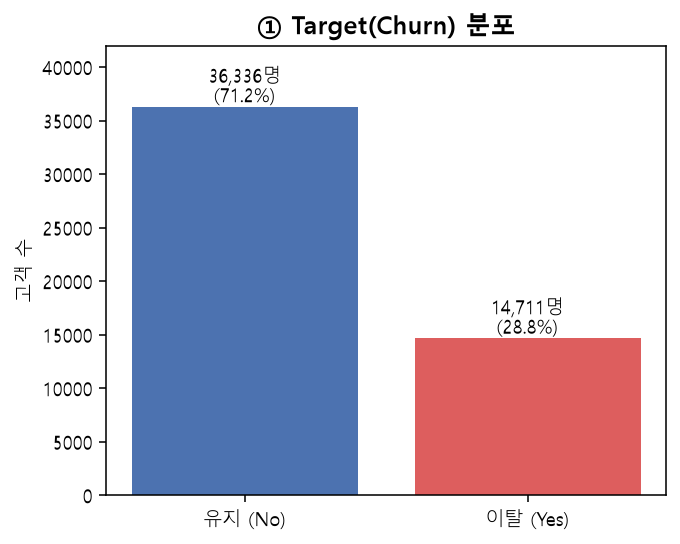
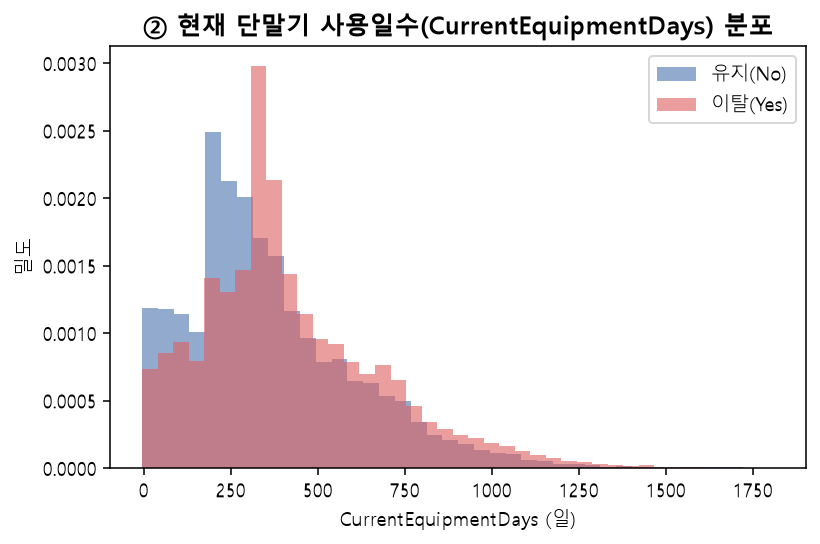
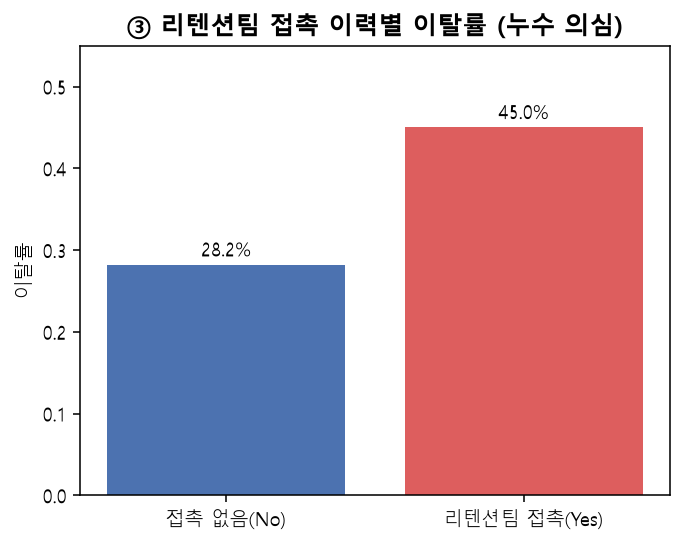
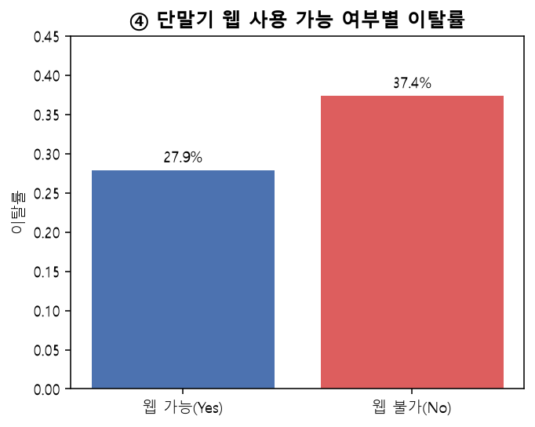
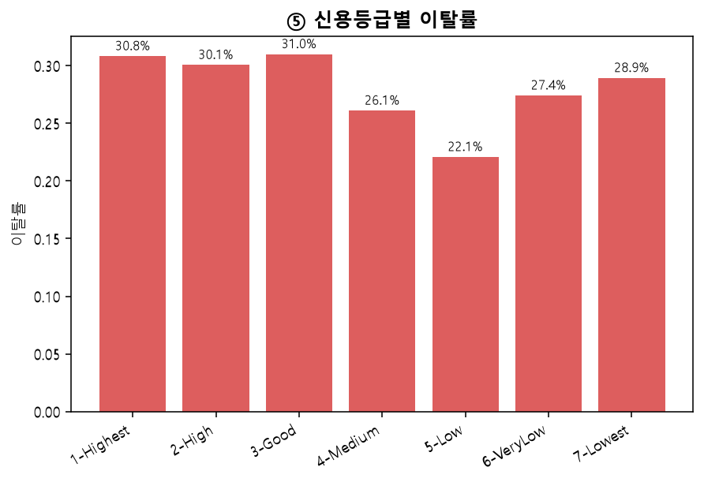
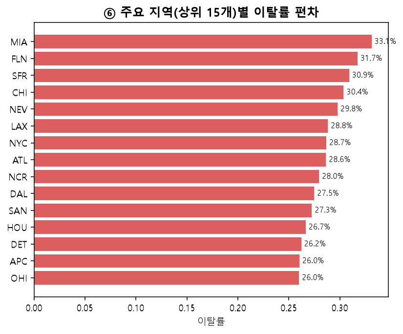
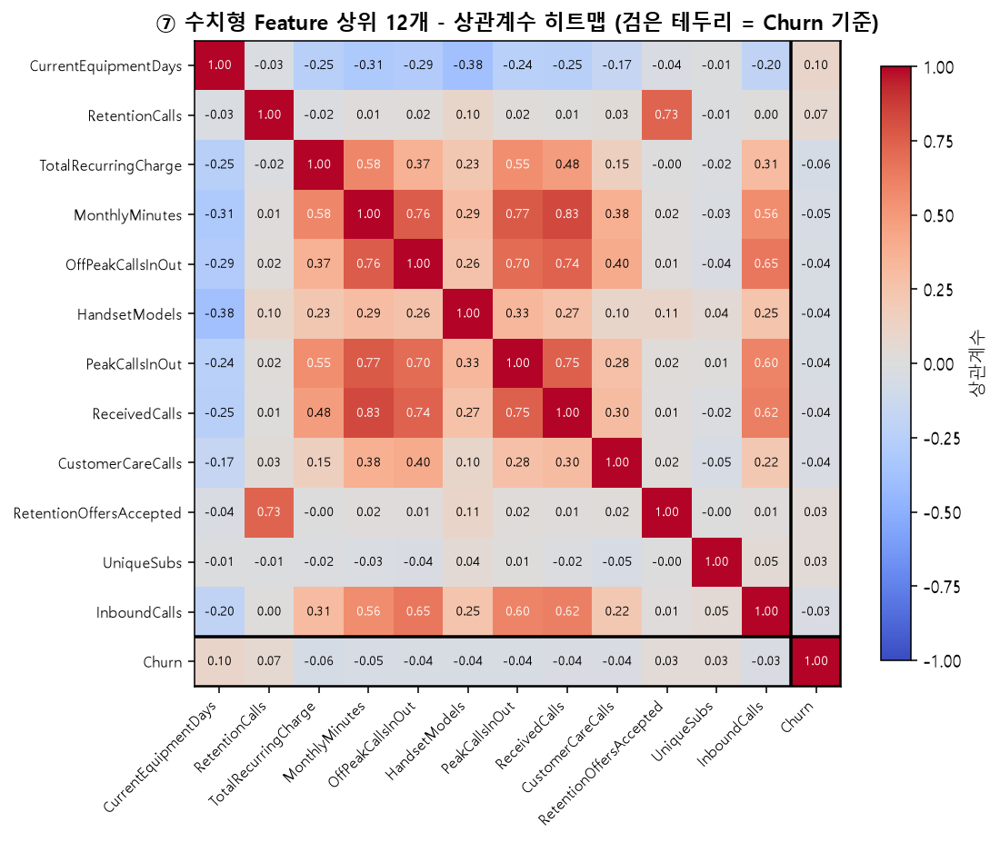

# 데이터 전처리 결과서 — Cell2Cell 통신사 고객 이탈 예측

## 1. 데이터 출처

| 항목 | 내용 |
|---|---|
| 출처 | Kaggle, `jpacse/datasets-for-churn-telecom` |
| URL | https://www.kaggle.com/datasets/jpacse/datasets-for-churn-telecom |
| 원본 제공 기관 | Duke University Fuqua School of Business, Teradata Center for Customer Relationship Management |
| 파일 | `cell2celltrain.csv`(51,047명, Target 포함) |
| 데이터 단위 | 고객 1명 = 1행 (스냅샷 데이터) |
| 실제/합성 | 실제 통신사 고객 데이터 (Cell2Cell, 1990년대 후반부터 CRM 교육 자료로 쓰여온 산업 데이터) |
| 개인정보 | 이름·연락처 없음. `CustomerID`는 일련번호, `ServiceArea`는 대도시권 단위 코드로 개인 위치 특정 불가 |

## 2. Target 정의

| 항목 | 내용 |
|---|---|
| Target 컬럼 | `Churn` ("Yes"/"No" → 1/0 변환) |
| 0 | 유지 고객 |
| 1 | 이탈 고객 |
| 클래스 비율 | 이탈 28.82% (14,711명) / 유지 71.18% (36,336명) |
| 사용자 | 통신사 고객유지팀 담당자 |
| 의사결정 | 이탈 방어 캠페인 대상자 선정 |
| 우선 지표 | Recall 우선 확인, F1·PR-AUC 병행 (FN 비용 > FP 비용) |

## 3. 데이터 품질 점검

| 점검 항목 | 결과 |
|---|---|
| 전체 규모 | 51,047행 × 58열 |
| CustomerID 중복 | 0건 |
| 전체 행 중복 | 미발견 |
| 결측치 있는 컬럼 | 14개 (아래 표) |
| 이상 소지 컬럼 | `ServiceArea`(고유값 747개), `HandsetPrice`(숫자+문자 혼재), `AgeHH1/2`(0-센티널과 진짜 결측 혼재) |

**결측치 현황** (전체 51,047행 기준)

| 컬럼 | 결측 수 | 비율 |
|---|---|---|
| AgeHH1 / AgeHH2 | 각 909 | 1.78% |
| PercChangeRevenues / PercChangeMinutes | 각 367 | 0.72% |
| MonthlyRevenue / MonthlyMinutes / RoamingCalls / OverageMinutes / DirectorAssistedCalls / TotalRecurringCharge | 각 156 | 0.31% |
| ServiceArea | 24 | 0.05% |
| Handsets / CurrentEquipmentDays / HandsetModels | 각 1 | 0.00% |

결측 비율이 전반적으로 낮고(최대 1.78%) 고르게 분산돼 있어 대부분 중앙값 대체로 충분하다고 판단했다. 다만 `AgeHH1`/`AgeHH2`는 별도 처리가 필요했다 (6-3절 참고).

## 4. EDA — 핵심 시각화 및 관찰

### ① Target(Churn) 분포



> **관찰**: 이탈 28.8% / 유지 71.2%로 중간 정도의 불균형이다. 따라서 Accuracy만으로 평가하면 안 되고 Recall·F1·PR-AUC를 함께 봐야 하며, 팀 방침대로 SMOTE보다 `class_weight='balanced'`를 모델링 1순위로 시도하는 게 합리적이다. 다만 이 비율이 실제 이 통신사의 현재 이탈률과 같다고 단정할 수는 없다 (수집 시점 불명).

### ② 현재 단말기 사용일수(CurrentEquipmentDays) 분포



> **관찰**: 이탈 고객이 유지 고객보다 현재 단말기를 더 오래 써온 쪽에 살짝 치우쳐 있다 — 이 데이터에서 Target과 상관계수가 가장 높은 변수(r=0.10)다. 따라서 "오래된 단말기를 쓰는 고객에게 새 단말기 업그레이드 오퍼를 제안"하는 유지 전략의 근거가 될 수 있다. 다만 상관계수 자체가 0.10으로 약해서, 이 변수 하나로 이탈을 설명하긴 어렵고 다른 변수와의 조합이 필요하다.

### ③ 리텐션팀 접촉 이력별 이탈률 — 누수 의심



> **관찰**: 리텐션팀에게 연락받은 적 있는 고객의 이탈률(45.0%)이 없는 고객(28.2%)보다 훨씬 높다. 언뜻 "리텐션팀이 연락하면 오히려 이탈이 늘어난다"로 보이지만, 실제로는 이탈 위험 신호가 이미 보인 고객을 리텐션팀이 먼저 골라서 연락했을 가능성(역인과관계)이 높다. 따라서 이 컬럼(`RetentionCalls`, `RetentionOffersAccepted`, `MadeCallToRetentionTeam`)은 포함 시 모델이 "리텐션팀이 연락 안 하면 이탈 안 한다"는 왜곡된 신호를 학습할 위험이 있다. 포함/제외 두 버전을 모두 만들어 모델링 단계에서 비교하기로 했다(6-2절). 다만 이게 진짜 역인과관계인지, 리텐션팀 접촉 자체가 실제로 이탈을 자극하는지는 이 데이터만으로 확정할 수 없다.

### ④ 단말기 웹 사용 가능 여부별 이탈률



> **관찰**: 웹을 지원하지 않는(구형) 단말기를 쓰는 고객의 이탈률(37.4%)이 웹 지원 단말기 사용 고객(27.9%)보다 뚜렷이 높다. 따라서 단말기 세대 관련 변수들(`HandsetWebCapable`, `HandsetModels`, `CurrentEquipmentDays`)을 묶어서 "단말기 노후도"라는 관점으로 유지 전략(단말기 업그레이드 프로모션)을 설계할 근거가 된다. 다만 웹 지원 여부와 가입 시기가 서로 얽혀 있을 수 있어(오래된 요금제일수록 구형 단말기), 단말기 자체의 효과인지 가입 시점의 효과인지는 구분이 어렵다.

### ⑤ 신용등급별 이탈률 — 비직관적 패턴



> **관찰**: 신용등급이 가장 좋은 `1-Highest`(30.8%)와 중간 등급인 `3-Good`(31.0%)의 이탈률이, 오히려 `5-Low`(22.1%)보다 높게 나타난다. "신용등급이 좋을수록 이탈률이 낮을 것"이라는 일반적 기대와 다른 방향이다. 따라서 `CreditRating`을 모델에 넣을 때 이 비선형적 관계를 트리 계열 모델이 잘 잡아낼 수 있는지 확인하고, 선형 모델(Logistic Regression)에서는 이 변수의 계수 해석에 주의가 필요하다. 다만 신용등급이 높은 고객은 그만큼 다른 통신사로 갈아탈 신용 조건도 잘 갖췄다는 간접적 해석이 가능하지만, 이 데이터만으로 원인을 단정할 수 없다.

### ⑥ 주요 지역(상위 15개)별 이탈률 편차



> **관찰**: 같은 상위 15개 대도시권 안에서도 이탈률이 지역마다 꽤 차이가 난다(최저~최고 구간 차이가 수 %p 수준). 따라서 지역 변수(`ServiceArea`)를 완전히 버리기보다는, 원본 747개 고유값을 앞 3자리 대도시권 코드로 축약해서(6-1절) Feature로 유지하기로 했다. 다만 지역별 이탈률 차이가 "그 지역 통신 인프라 품질" 때문인지 "그 지역 고객층 특성" 때문인지는 이 데이터로 구분할 수 없다.

### ⑦ 수치형 Feature 상위 12개와 Target의 상관계수



> **관찰**: 가장 강한 변수(`CurrentEquipmentDays`)도 Churn과의 상관계수가 0.10
> 수준이고, 상위 12개 변수 대부분이 ±0.03~0.10 사이에 몰려 있다. 개별 변수의
> 설명력이 전반적으로 약하다 — 참고로 로지스틱 회귀 단일 모델 사전 테스트에서도
> AUC가 0.61 수준에 그쳤다. 한편 히트맵으로 보면 Target과 무관하게 **`MonthlyMinutes`와
> `ReceivedCalls`가 상관계수 0.83으로 거의 같이 움직이는 다중공선성**이 눈에 띈다 —
> 통화량이 많을수록 받는 전화도 많아지는 자연스러운 관계로 보이며, 선형 계열
> 모델(Logistic Regression)에서는 이런 변수 쌍이 계수 해석을 불안정하게 만들 수
> 있어 유의해야 한다. 종합하면 단일 변수 규칙이 아니라 **여러 변수의 조합·상호작용을
> 잡아내는 Boosting 계열 모델이 특히 중요**할 것으로 예상된다. 다만 선형 상관계수만
> 본 것이라 비선형 관계는 여기서 안 보였을 수 있다.

## 5. 비즈니스 인사이트 3가지

1. **단말기 노후도(오래 사용·웹 미지원)가 이탈과 관련이 있다.** 오래된 단말기를 쓰는 고객에게 업그레이드 프로모션을 제안하는 전략의 근거가 된다.
2. **리텐션팀 접촉 이력은 "이미 위험 신호가 보인 고객"의 지표일 가능성이 크다.** 이 변수를 그대로 모델에 넣으면 해석이 왜곡될 수 있어, 성능과 해석 가능성을 모두 고려해 포함 여부를 결정해야 한다.
3. **지역(대도시권)별로 이탈률 차이가 존재한다.** 전국 단일 전략보다 지역별 캠페인 강도를 다르게 가져갈 근거가 된다.

## 6. 인사이트에 따른 전처리·모델링 결정 3가지 (+실제 처리 근거)

### 6-1. ServiceArea(747개 고유값) → 대도시권 코드(3자리) 축약 + 희소 지역 그룹화
그대로 원-핫 인코딩하면 747개 컬럼이 생겨 차원이 폭발하고, 표본이 적은 지역은 통계적으로 신뢰하기 어렵다. 앞 3자리만 잘라내 57개로 줄이고, Train 기준 50건 미만인 18개 지역은 `Other`로 묶어 최종 범주 수를 관리 가능한 수준으로 낮췄다. 이 기준(희소 지역 목록)은 Train에서만 계산하고 Val/Test에 그대로 재사용했다.

### 6-2. 리텐션 관련 3개 컬럼 → 포함/제외 비교 후 제외 버전 채택
③번 관찰에서 발견한 역인과관계 가능성을 검토하기 위해 `train_with_retention.csv`와 `train_without_retention.csv`를 모두 만들었다. 두 버전의 성능과 Feature Importance를 비교한 뒤, 실제 예측 시점에 확보 여부가 불명확한 정보를 배제하고 해석의 안전성을 높이기 위해 **리텐션 제외 버전**을 최종 채택했다. 비교용 파일은 `data/interim/`에, 최종 학습 테이블은 `data/processed/`에 구분해 보관한다.

### 6-3. AgeHH1/AgeHH2 결측치 → 중앙값 대신 0으로 대체
데이터를 직접 열어보니 이 두 컬럼은 이미 **0을 "해당 세대원 없음"이라는 의미로 광범위하게 사용 중**이었다 (`AgeHH1==0`이 13,917건, `AgeHH2==0`이 26,087건). 반면 진짜 결측(NaN, 909건, 두 컬럼이 항상 함께 결측)은 "정보 자체가 기록되지 않음"이라는 별개의 의미다. 그런데도 이 데이터셋이 이미 0을 "정보 없음/해당 없음"의 센티널로 광범위하게 쓰고 있으므로, 그럴듯한 중앙값 나이를 채워 넣기보다 **기존 인코딩 관례에 맞춰 0으로 채우는 쪽이 더 일관적**이라고 판단했다. (다른 수치형 컬럼은 이런 특이 패턴이 없어 일반적인 Train 중앙값 대체를 사용했다.)

### (추가) HandsetPrice 처리
`'10'`부터 `'500'`까지의 숫자 문자열과 `'Unknown'`이 섞여 있었다. `'Unknown'`을 버리지 않고 `HandsetPrice_Unknown`이라는 별도 표시 컬럼으로 남긴 뒤, 숫자 부분은 결측으로 처리해 수치형 파이프라인의 중앙값 대체를 타도록 했다 — "가격 정보가 없다"는 사실 자체가 신호일 수 있기 때문이다.

## 전처리 항목 요약

| 대상 컬럼/항목 | 발견된 문제 | 처리 방법 | 왜 이렇게 했나 |
|---|---|---|---|
| `CustomerID` | 단순 식별자 | Feature에서 제외 | 예측에 쓸 정보가 없고, 남겨두면 모델이 우연한 패턴을 학습할 위험 |
| 수치형 7개 컬럼 (`MonthlyRevenue`, `MonthlyMinutes` 등, 결측 0.3~0.7%) | 결측치 소량 존재 | Train **중앙값**으로 대체 | 결측 비율이 낮고 무작위로 흩어져 있어, 행 삭제보다 대표값 대체가 정보 손실이 적음 |
| `AgeHH1` / `AgeHH2` (결측 1.78%) | 0이 이미 "세대원 없음"의 센티널로 쓰이고 있어 중앙값 대체가 부적절 | 결측치를 **0으로 대체** (중앙값 대신) | 기존 데이터의 0-인코딩 관례와 일관성을 유지하기 위함 |
| `ServiceArea` | 고유값 747개 → 그대로 원-핫하면 차원 폭발 | 앞 3자리 대도시권 코드로 축약(57개) + Train 기준 50건 미만 지역은 `Other`로 그룹화 | 차원 축소 + 표본 적은 지역의 통계적 불안정성 방지 |
| `HandsetPrice` | 숫자 문자열과 `'Unknown'`이 혼재 | 숫자로 변환 + `HandsetPrice_Unknown` 플래그 컬럼 신설 후 결측 처리 | "가격 정보 없음" 자체가 신호일 수 있어 정보 손실 없이 분리 |
| `RetentionCalls`, `RetentionOffersAccepted`, `MadeCallToRetentionTeam` | 역인과관계 의심(리텐션팀 접촉 고객의 이탈률이 오히려 높음) | 포함 버전 / 제외 버전 **두 세트 모두 생성** | 누수인지 정상 신호인지 이 데이터만으로 확정할 수 없어 모델링 단계에서 비교 실험하도록 넘김 |
| 나머지 범주형 18개 (`Gender`, `CreditRating`, `PrizmCode` 등) | 문자열이라 모델 입력 불가 | One-Hot Encoding (`handle_unknown="ignore"`) | 카테고리 간 크기·순서 관계가 없어 순서형 숫자 대신 원-핫 사용. 신규 데이터에 못 보던 값이 나와도 에러 방지 |
| 나머지 수치형 전체 | 컬럼마다 값의 범위(스케일)가 제각각 | `StandardScaler`로 표준화(평균 0, 표준편차 1) | 스케일에 민감한 모델(Logistic Regression 등)과 트리 계열 모델을 같은 조건에서 공정 비교하기 위함 |
| 전체 데이터 | Train/Val/Test로 나누기 전에 전처리하면 데이터 누수 위험 | **분리를 가장 먼저 수행**(Train 60% / Val 20% / Test 20%, `stratify=Churn`) 후, 위 모든 대표값·기준을 Train에서만 계산 | Test 정보가 전처리 기준 계산에 섞여 들어가는 것을 방지 |
| 클래스 불균형 (이탈 28.8%) | 다소 불균형 | 전처리 단계에서 SMOTE 미적용 | 모델링 단계에서 `class_weight='balanced'`를 우선 시도하기로 팀 방침 결정 |

### 6-4. 최종 Feature 산출 내역 (차원 변화)
원본 데이터의 56개 예측 후보 컬럼(식별자 및 Target 제외)은 전처리를 거치며 범주형 컬럼의 One-Hot Encoding으로 인해 차원이 확장되었습니다.
* **리텐션 제외 버전:** 최종 **126개** Feature 산출 (수치형 33개 + 범주형 93개)
* **리텐션 포함 버전:** 최종 **130개** Feature 산출 (리텐션 관련 수치형 2개 및 이진 범주형 2분할 컬럼 추가)

## 7. Train / Validation / Test 분리

| 세트 | 행 수 | 이탈률 |
|---|---|---|
| Train | 30,627 (60%) | 28.82% |
| Validation | 10,210 (20%) | 28.81% |
| Test | 10,210 (20%) | 28.81% |

`stratify=Churn`을 적용한 랜덤 분리이며(고객 1명=1행, 시간/그룹 분할 불필요), ServiceArea 희소 지역 그룹화·결측치 대표값·인코딩 범주·스케일 모두 이 분리 이후 Train에서만 계산했다.

## 8. Target 누수(Leakage) 점검

- 해지 사유, 해지일 등 이탈 이후에만 생기는 정보에 해당하는 컬럼은 없음을 확인했다.
- **리텐션 컬럼 3개는 "의심 표시 + 두 버전 비교"로 검증한 뒤 최종 Feature에서 제외**했다(6-2절). 예측 시점이 명확하지 않은 정보를 운영 모델에 넣어 성능이 과대평가되는 위험을 줄이기 위한 결정이다.

## 9. 산출물

```
data/raw/cell2celltrain.csv                       원본 (수정 없음, 51,047행)
data/interim/train_with_retention.csv              전처리 완료·실험용 (리텐션 컬럼 포함)
data/interim/train_without_retention.csv           전처리 완료·실험용 (리텐션 컬럼 제외)
data/interim/val_*.csv, test_*.csv                 동일 기준으로 처리된 Val/Test (두 버전)
data/processed/train.csv, val.csv, test.csv        최종 채택된 리텐션 제외 버전 (운영·Test·추론 기준)
artifacts/preprocessor_with_retention.joblib       Train에서 fit한 전처리 Pipeline
artifacts/preprocessor_without_retention.joblib
artifacts/feature_schema.json                      Feature 목록·Target 의미·분리 비율·희소 지역 목록 등
notebooks/00_data_check.ipynb                      1차 데이터 점검 (shape·중복·결측·지저분한 컬럼 미리보기)
notebooks/01_eda.ipynb                              EDA 시각화 7종 + 인사이트·결정·한계 (실행 결과 내장)
assets/images/eda/*.png                               EDA 시각화 7종 (마크다운용 별도 파일)
src/data.py                                          본 전처리를 재현하는 스크립트
```

## 10. 데이터 한계

- 이 데이터의 개별 Feature와 Target의 상관관계가 전반적으로 약하다(⑦번 참고, 최댓값 0.10). 이는 실제 통신 이탈 예측이 학계에서도 어려운 문제로 알려진 것과 일치하지만, 다른 데이터 셋과 비교해 최종 모델 성능(AUC, F1 등)이 낮게 나올 수 있음을 발표에서 미리 설명할 필요가 있다.
- 리텐션 컬럼의 역인과관계 여부(6-2절)는 이 데이터만으로 확정할 수 없으며, 모델링 단계의 비교 실험 결과에 따라 판단이 달라질 수 있다.
- `NewCellphoneUser`/`NotNewCellphoneUser` 두 컬럼이 서로 완전히 배타적이지 않다(Yes/Yes 조합은 없지만 No/No 조합이 34,188건 존재). 두 컬럼의 정확한 정의 차이가 데이터 사전에 없어 추가 확인이 필요하다.
- `MaritalStatus`에 결측이 아닌 명시적 `"Unknown"` 카테고리가 있다(19,700건, 전체의 약 38%) — 결측 대체가 아니라 원래부터 그렇게 수집된 값으로 보이며, 별도 카테고리로 유지했다.
- 데이터 수집 시점이 명시돼 있지 않아 현재 통신 시장 상황(5G 전환 등)과 얼마나 다른지 알 수 없다.
- `MonthlyRevenue`(3건), `TotalRecurringCharge`(8건), `CurrentEquipmentDays`(76건)에서 소수의 음수값이 확인되었습니다. 환불/조정(Credit adjustment)이나 데이터 입력 시점의 오류일 가능성이 있으나 데이터 사전에 명시되어 있지 않습니다. 전체 데이터 대비 비율이 극히 미미하여(최대 0.15%) 이번 1차 전처리 파이프라인에서는 별도로 조정하지 않았으나, 추후 모델 고도화 시 `0`으로 Clip 하거나 결측 처리 후 중앙값으로 대체하는 방안을 고려할 수 있습니다.

## 11. 결론

이 데이터는 51,047명 규모의 실제 통신사 고객 스냅샷이며, 결측치·중복은 관리 가능한 수준이었지만 `ServiceArea`(747개 고유값), `HandsetPrice`(숫자·문자 혼재), `AgeHH1/AgeHH2`(0-센티널과 진짜 결측 혼재) 세 컬럼은 그대로 쓸 수 없어 별도 정제가 필요했다. EDA 결과 개별 Feature와 Target의 상관관계가 전반적으로 약했고, 이는 통신 이탈 예측이 실제로 어려운 문제라는 점과 일치한다 — 따라서 이후 모델링 단계에서는 단일 변수보다 **여러 변수의 조합을 잡아내는 Boosting 계열 모델**의 역할이 중요할 것으로 예상된다.

가장 중요한 이슈는 **리텐션 컬럼 3개의 역인과관계 가능성**이었다(6-2절). 포함/제외 버전을 비교한 결과, 예측 시점의 불확실성과 성능 과대평가 위험을 고려해 리텐션 제외 버전을 최종 채택했다. 세부 성능과 선정 근거는 `modeling_report.md`에 기록했다.

전체적으로 이 데이터는 "정답에 가까운 깨끗한 데이터"가 아니라 노이즈가 있는 현실적인 이탈 예측 문제이며, 발표에서 성능이 완벽하지 않은 이유를 미리 설명해두는 것이 청중의 기대치를 관리하는 데 도움이 될 것이다.

## 12. 최종 추출 결과물 요약

| 결과물                                           | 상태 | 위치                                                                          |
|-----------------------------------------------|---|-----------------------------------------------------------------------------|
| 데이터 품질 점검                                     | ✅ 완료 | `notebooks/00_data_check.ipynb`                                             |
| EDA 시각화 7종 + 인사이트 3개 + 결정 3개                  | ✅ 완료 | `notebooks/01_eda.ipynb`, `assets/images/eda/*.png`                           |
| 전처리 Pipeline (비교용 포함/제외 버전, 최종 제외 버전)      | ✅ 완료 | `src/data.py` → `artifacts/preprocessor_*.joblib`                           |
| Train/Validation/Test 분리 (60/20/20, stratify) | ✅ 완료 | 실험본: `data/interim/*.csv` / 최종본: `data/processed/{train,val,test}.csv` |
| Feature 메타데이터                                 | ✅ 완료 | `artifacts/feature_schema.json`                                             |
| 전처리 결과서(본 문서)                                 | ✅ 완료 | `reports/preprocessing_report.md`                                           |
| 학습 테이블 생성                                     | ✅ 완료 | 최종본: `data/processed/{train,val,test}.csv` (리텐션 제외) / 실험본은 `data/interim/` 유지 |

두 버전의 Validation 성능(Recall·F1·PR-AUC)과 Feature Importance를 비교해 `without_retention`을 최종 채택했으며, 결정 근거는 `modeling_report.md`에 정리했다.
